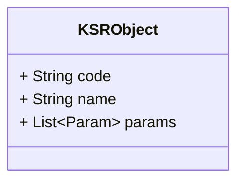
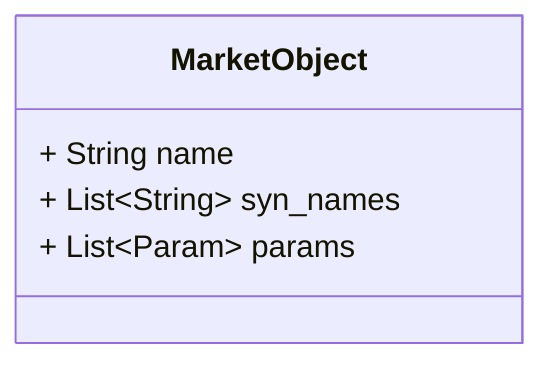
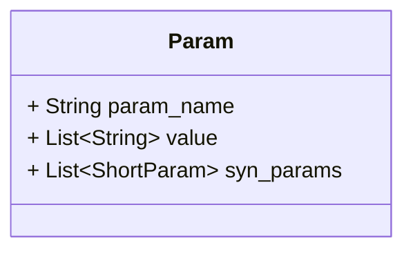
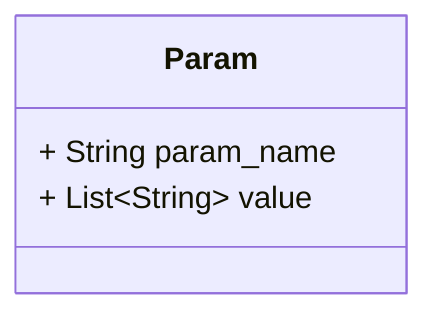
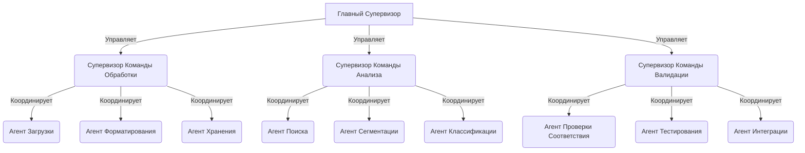
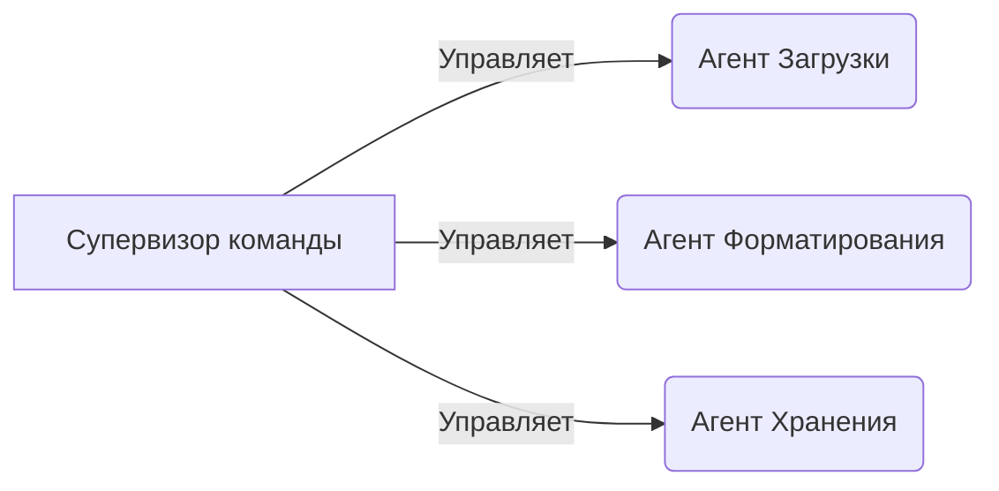
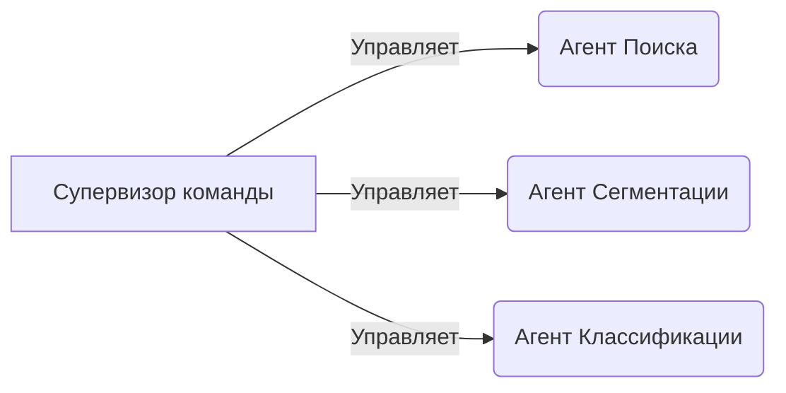
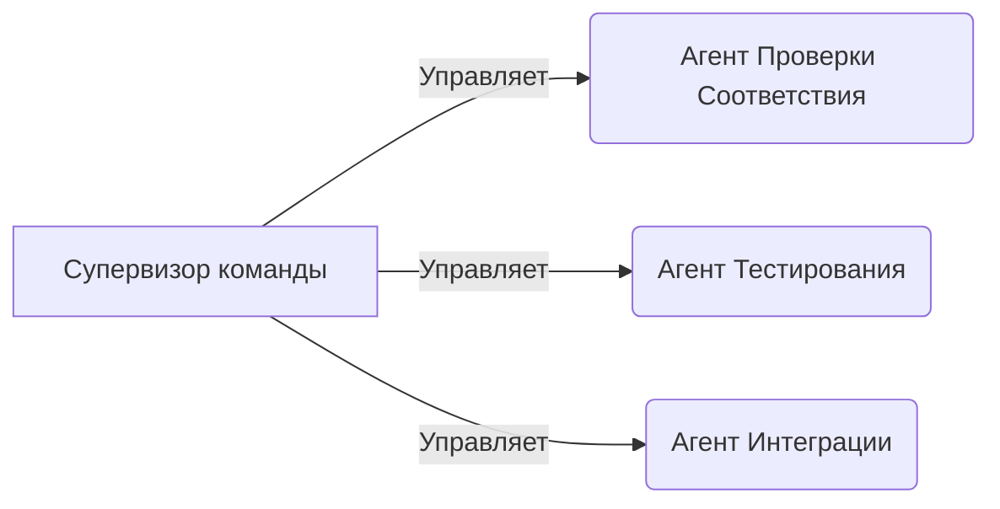

Система - программный продукт, использующий технологии машинного обучения для автоматизации процессов сопоставления строительных материалов, представленных на различных маркетплейсах, с единым классификатором строительных ресурсов (КСР). Основная цель системы — упрощение процесса поиска и сопоставления материалов, что способствует повышению эффективности управления закупками на строительных проектах.

Алгоритм работы системы включает следующие шаги:

1. Загрузка пользователем списка материалов с маркетплейса в формате XML.
2. Анализ и обработка данных с использованием модели llama3-7b для выявления соответствующих наименований в КСР.
3. Вывод результатов пользователю и возможность корректировки результатов для улучшения точности сопоставления.
4. Дообучение модели на основе пользовательского взаимодействия для повышения точности идентификации в будущем.

Технологическая стек и инструментарий:

- Векторная БД: **???**
- Python: Язык программирования для создания бэкенда системы.
- llama3-7b: Модель машинного обучения для анализа и обработки данных.
- Docker и Kubernetes: Используются для развертывания и масштабирования приложения в производственной среде.
- Git: Версионный контроль для управления кодом проекта.


# Данные 


## Объект КСР

Описывает объект, используя только информацию из КСР. Если у параметра присутствует только значение, без наименования параметра, то параметр именуется "none"



JSON пример

```json
{  
  "code": "16.21.12.119.11.2.11.06-1000-000",  
  "name": "фанера",  
  "params": [  
    {  
      "param_name": "none",  
      "value": "березовая"  
    },  
    {  
      "param_name": "none",  
      "value": "облицованная пленкой с двух сторон"  
    },  
    {  
      "param_name": "none",  
      "value": "имеющая гладкую поверхность с обеих сторон"  
    },  
    {  
      "param_name": "сорт",  
      "value": "III/III"  
    },  
    {  
      "param_name": "толщина",  
      "value": "12 мм"  
    }  
  ]  
}
```

## Объект Макрета



json

```json
{  
  "name": "баббит",  
  "syn_names": [  
    "подшипниковый сплав",  
    "свинцовый сплав"  
  ],  
  "params": [  
    {  
      "param_name": "Тип",  
      "value": "свинцовый",  
      "syn_params": [  
        {  
          "param_name": "Состав",  
          "value": "свинцовый"  
        },  
        {  
          "param_name": "Класс",  
          "value": "свинцовый"  
        }  
      ]  
    },  
    {  
      "param_name": "Марка",  
      "value": "БКА",  
      "syn_params": [  
        {  
          "param_name": "Код",  
          "value": "БКА"  
        },  
        {  
          "param_name": "Обозначение",  
          "value": "БКА"  
        }  
      ]  
    },  
    {  
      "param_name": "Стандарт",  
      "value": "ГОСТ 1209-90",  
      "syn_params": [  
        {  
          "param_name": "Норматив",  
          "value": "1209-90"  
        },  
        {  
          "param_name": "ГОСТ",  
          "value": "1209-90"  
        }  
      ]  
    },  
    {  
      "param_name": "Расположение",  
      "value": "Москва",  
      "syn_params": [  
        {  
          "param_name": "Город",  
          "value": "Москва"  
        },  
        {  
          "param_name": "Локация",  
          "value": "Москва"  
        }  
      ]  
    }  
  ]  
}
```

## Параметр



## Короткие параметры



# Агенты



### Команда: Команда Обработки



#### Агент: Агент Загрузки

**Описание**: Отвечает за загрузку данных из внешних источников.

```
Загрузите данные из указанного источника и подготовьте их к дальнейшей обработке
```

```python
from langchain.chains import ChainedFunction, DataRetrieval

def load_data(source):
    # Загрузка данных
    return source.read_data()

load_data_chain = ChainedFunction(
    functions=[DataRetrieval(retrieve_function=load_data)]
)
```

#### Агент: Агент Форматирования

**Описание**: Преобразует загруженные данные в нужный формат.

```
Преобразуйте загруженные данные в формат, подходящий для хранения и анализа
```

```python
from langchain.chains import ChainedFunction, DataTransformation

def format_data(raw_data):
    # Форматирование данных
    return process_data(raw_data)

format_data_chain = ChainedFunction(
    functions=[DataTransformation(transform_function=format_data)]
)
```

#### Агент: Агент Хранения

**Описание**: Сохраняет обработанные данные в базе данных.

```
Сохраните обработанные данные для дальнейшего доступа и использования
```

```python
from langchain.chains import ChainedFunction, DataExport

def store_data(formatted_data):
    # Сохранение данных
    database.save(formatted_data)

store_data_chain = ChainedFunction(
    functions=[DataExport(export_function=store_data)]
)
```

### Команда: Команда Анализа



#### Агент: Агент Поиска

**Описание**: Выполняет поиск и идентификацию данных в хранилище.

```
Найдите и идентифицируйте необходимые данные в хранилище на основе заданных критериев
```

```python
from langchain.chains import ChainedFunction, DataRetrieval

def search_data(criteria):
    # Поиск данных
    return database.search(criteria)

search_data_chain = ChainedFunction(
    functions=[DataRetrieval(retrieve_function=search_data)]
)
```

#### Агент: Агент Сегментации

**Описание**: Разделяет данные на сегменты для удобства анализа.

```
Разделите данные на логические сегменты для удобства дальнейшего анализа
```

```python
from langchain.chains import ChainedFunction, DataTransformation

def segment_data(data):
    # Сегментация данных
    return segment_logic(data)

segment_data_chain = ChainedFunction(
    functions=[DataTransformation(transform_function=segment_data)]
)
```

#### Агент: Агент Классификации

**Описание**: Классифицирует данные по определенным категориям.

```
Классифицируйте данные на основе заранее определенных категорий для дальнейшего использования
```

```python
from langchain.chains import ChainedFunction, DataTransformation

def classify_data(data):
    # Классификация данных
    return classification_model.predict(data)

classify_data_chain = ChainedFunction(
    functions=[DataTransformation(transform_function=classify_data)]
)
```

### Команда: Команда Валидации



#### Агент: Агент Проверки Соответствия

**Описание**: Проверяет данные на соответствие стандартам и требованиям.

```
Проверьте данные на соответствие заданным стандартам и требованиям безопасности
```

```python
from langchain.chains import ChainedFunction, DataValidation

def validate_data(data):
    # Проверка соответствия данных
    return validate_standards(data)

validate_data_chain = ChainedFunction(
    functions=[DataValidation(validate_function=validate_data)]
)
```

#### Агент: Агент Тестирования

**Описание**: Тестирует данные и систему на устойчивость и корректность работы.

```
Проведите комплексное тестирование системы и данных для обеспечения их корректной работы
```

```python
from langchain.chains import ChainedFunction, DataTesting

def test_data(data):
    # Тестирование данных
    return run_tests(data)

test_data_chain = ChainedFunction(
    functions=[DataTesting(test_function=test_data)]
)
```

#### Агент: Агент Интеграции

**Описание**: Интегрирует проверенные и тестированные данные с другими системами.

```
Интегрируйте проверенные данные с другими системами для обеспечения полноценной работы
```

```python
from langchain.chains import ChainedFunction, DataIntegration

def integrate_data(data):
    # Интеграция данных
    return integrate_systems(data)

integration_data_chain = ChainedFunction(
    functions=[DataIntegration(integrate_function=integrate_data)]
)
```

---

# Вопросы

**№1. Что выдавать, если объекта нет в КСР?** 

> Добавлять

**№2. Разные параметры у одного объекта?**  

например есть в КСР 

```
Щит распределительный встраиваемый ЩРВ-24, размеры 330х300х120 мм
```

но в маркете он 

```
Щит распределительный встраиваемый EKF PROxima ЩРВ-24 металлический IP31 390х340х120 мм 24 модуля
```

это один и тот же элемент?

> Разные элементы

**№3. Одна сущность, но с дополнительным параметром, которого нет в КСР** 

Например в КСР есть: 

```
Кабель силовой с медными жилами ВВГнг(A)-LS 3х2,5ок(N, PE)-660
```

а на маркете он 

```
Кабель Кабэкс ВВГПнг(А)-LS 3х2,5
```

где ВВГ***П***нг - плоский

> Та же сущность, но с дополнительным параметром 

