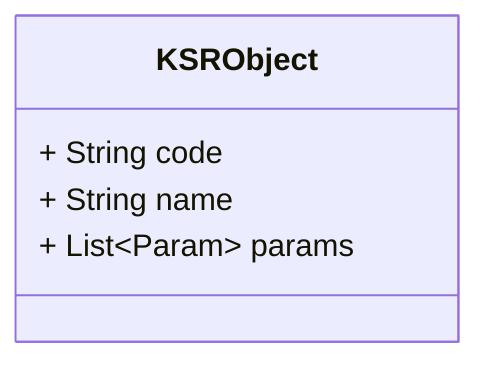
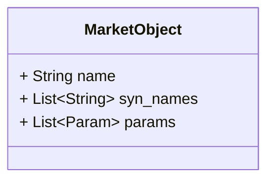
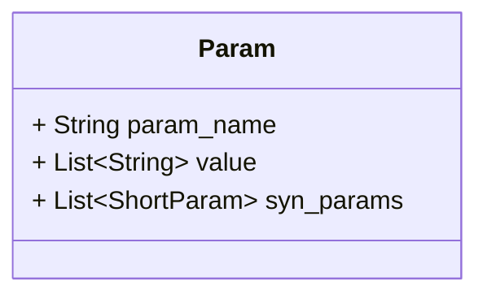
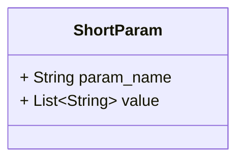

Система - программный продукт, использующий технологии машинного обучения для автоматизации процессов сопоставления строительных материалов, представленных на различных маркетплейсах, с единым классификатором строительных ресурсов (КСР). Основная цель системы — упрощение процесса поиска и сопоставления материалов, что способствует повышению эффективности управления закупками на строительных проектах.

Алгоритм работы системы включает следующие шаги:

1. Загрузка пользователем списка материалов с маркетплейса в формате XML.
2. Анализ и обработка данных с использованием модели llama3-7b для выявления соответствующих наименований в КСР.
3. Вывод результатов пользователю и возможность корректировки результатов для улучшения точности сопоставления.
4. Дообучение модели на основе пользовательского взаимодействия для повышения точности идентификации в будущем.

Технологическая стек и инструментарий:

- Векторная БД: **???**
- Python: Язык программирования для создания бэкенда системы.
- llama3-7b: Модель машинного обучения для анализа и обработки данных.
- Docker и Kubernetes: Используются для развертывания и масштабирования приложения в производственной среде.
- Git: Версионный контроль для управления кодом проекта.


# Данные 


## Объект КСР


Описывает объект, используя только информацию из КСР. Если у параметра присутствует только значение, без наименования параметра, то параметр именуется "none"



JSON пример

```json
{  
  "code": "16.21.12.119.11.2.11.06-1000-000",  
  "name": "фанера",  
  "params": [  
    {  
      "param_name": "none",  
      "value": "березовая"  
    },  
    {  
      "param_name": "none",  
      "value": "облицованная пленкой с двух сторон"  
    },  
    {  
      "param_name": "none",  
      "value": "имеющая гладкую поверхность с обеих сторон"  
    },  
    {  
      "param_name": "сорт",  
      "value": "III/III"  
    },  
    {  
      "param_name": "толщина",  
      "value": "12 мм"  
    }  
  ]  
}
```

## Объект Макрета




json

```json
{  
  "name": "баббит",  
  "syn_names": [  
    "подшипниковый сплав",  
    "свинцовый сплав"  
  ],  
  "params": [  
    {  
      "param_name": "Тип",  
      "value": "свинцовый",  
      "syn_params": [  
        {  
          "param_name": "Состав",  
          "value": "свинцовый"  
        },  
        {  
          "param_name": "Класс",  
          "value": "свинцовый"  
        }  
      ]  
    },  
    {  
      "param_name": "Марка",  
      "value": "БКА",  
      "syn_params": [  
        {  
          "param_name": "Код",  
          "value": "БКА"  
        },  
        {  
          "param_name": "Обозначение",  
          "value": "БКА"  
        }  
      ]  
    },  
    {  
      "param_name": "Стандарт",  
      "value": "ГОСТ 1209-90",  
      "syn_params": [  
        {  
          "param_name": "Норматив",  
          "value": "1209-90"  
        },  
        {  
          "param_name": "ГОСТ",  
          "value": "1209-90"  
        }  
      ]  
    },  
    {  
      "param_name": "Расположение",  
      "value": "Москва",  
      "syn_params": [  
        {  
          "param_name": "Город",  
          "value": "Москва"  
        },  
        {  
          "param_name": "Локация",  
          "value": "Москва"  
        }  
      ]  
    }  
  ]  
}
```

## Параметр



## Короткие параметры



# Агенты

## Supervisor

*В разработке*

## KSR Name Extractor

**Системный промпт**:
```
Задача: Разделить строку на наименование и параметры товара.

Шаги выполнения:

1. Определить наименование товара:
   - Наименование - существительное, которые описывает тип материала или продукт (например, "Кабель", "Блок", "соль"). 
   - Наименование может быть: одним словом (чаще всего); не одним словом, а скорее фразой, описывающей тип продукта (редко); аббревиатурой (очень редко).
   - Слово-наименование может быть не первым словом.
   - Игнорируй: названия торговой марки, названия производителя, прилагательные, наречия, НЕ существительное, слова, являющиеся параметрами, предлоги, префиксы, суффиксы, союзы

2. Определить параметры товара:
   - Все остальное в строке после наименования считать параметрами товара.
   - Параметры могут включать тип, размеры, материалы.

Формат вывода: JSON объект с двумя ключами:
- "name": строка с наименованием товара.
- "params": строка с параметрами товара.


Пример работы:
Входная строка: "Натриевая соль 2-метил 4-хлорфенокси-уксусной кислоты (2м-4х)"
Ожидаемый вывод:
{ 
  "name": "соль", 
  "params": "Натриевая 2-метил 4-хлорфенокси-уксусной кислоты (2м-4х)" 
}


Требования:
- Строго следовать инструкциям для извлечения наименования и параметров.
- Результаты должны быть точно сформированы в JSON формате.
- Обработка должна быть корректной для строк с разной структурой и длиной параметров.
- В качестве ответа ТОЛЬКО JSON.
```

**Задача**: 
Разделение строки на код, наименование и параметры товара.

**Входные данные**: 
Строка, содержащая информацию о товаре в формате: "код товара наименование товара параметры товара".

**Шаги выполнения**:
1. **Извлечение кода**: Код товара находится в начале строки и отделён от остальной части пробелом. Это последовательность цифр и точек, завершающаяся дефисом и числовым кодом. Например, "27.32.13.111.21.1.06.09-0151-000".
2. **Извлечение наименования**: Наименование следует сразу за кодом и содержит только одно слово, указывающее на основной тип товара, например, "Кабель".
3. **Извлечение параметров**: Оставшаяся часть строки после наименования товара считается параметрами. Параметры могут включать типы, размеры, материалы и другие специфические характеристики товара.

**Формат вывода**: 
JSON объект с тремя полями:
- "code": строка, содержащая код товара.
- "name": строка, содержащая наименование товара.
- "params": строка, содержащая параметры товара.

**Пример работы**:
Входная строка: 
```
27.32.13.111.21.1.06.09-0152-000 Кабель силовой с медными жилами ВВГнг(A)-LS 3х2,5ок(N, PE)-660
```
Ожидаемый вывод:
```json
{
  "code": "27.32.13.111.21.1.06.09-0152-000",
  "name": "Кабель",
  "params": "силовой с медными жилами ВВГнг(A)-LS 3х2,5ок(N, PE)-660"
}
```

**Требования к реализации**:
- Агент должен точно следовать инструкциям по извлечению кода, наименования и параметров.
- Результаты должны быть точно сформированы в JSON формате согласно указанной структуре.
- Обеспечить корректную обработку строк с различной длиной и структурой параметров.

## Names Synthesizer 

**Задача:**  
Агент должен генерировать список синонимов для заданной строки, которая обозначает термин или наименование в контексте строительных материалов.

**Входные данные:**  
Строка (наименование объекта), например "Фанера".

**Шаги выполнения:**  
1. Анализ входной строки для определения контекста (строительные материалы, инструменты, технологии).
2. Поиск в базах данных и открытых источниках для сбора информации о возможных синонимах и аналогах входной строки.
3. Анализ собранной информации для формирования списка релевантных синонимов.
4. Проверка каждого синонима на уникальность и отсутствие повторов в списке.
5. Формирование итогового списка синонимов.

**Формат вывода:**  
JSON-структура, где указано наименование и список синонимов:
```json
{
  "name": "наименование",
  "syn_names": ["синоним1", "синоним2", ...]
}
```

**Пример работы:**  
Для входных данных "Фанера":
```json
{
  "name": "Фанера",
  "syn_names": [
    "Фанерный лист",
    "Шпон",
    "Листовой материал",
    "Многослойный материал",
    "Слоистый древесный материал",
    "Облицовочный материал",
    "Склеенный древесный лист"
  ]
}
```

**Требования к реализации:**  
- Агент должен использовать верифицированные источники данных.
- Необходимо обеспечить высокую точность и релевантность синонимов.
- Важно минимизировать дублирование синонимов.
- Агент должен быть способен обрабатывать запросы в режиме реального времени с минимальной задержкой.
- Программное обеспечение должно быть масштабируемым и поддерживать возможность расширения базы синонимов и источников данных.
- Соблюдение принципов конфиденциальности и защиты данных во время работы с внешними и внутренними базами данных.

## Params Extractor

```
Задача: Разделить строку с параметрами и характеристиками материала или оборудования на отдельные параметры.

Шаги выполнения:

1. Прочитать входную строку

2. Определить границы каждого параметра

3. Обработать каждый параметр отдельно, чтобы убедиться, что он правильео извлечён

Формат вывода: JSON массив со строками value:
- "name": строка с характеристиками материала или оборудования.

Пример работы:
Входная строка: "силовой с медными жилами ВВГнг(A)-LS 3х2,5ок(N, PE)-660"
Ожидаемый вывод:
[
  {
    "value": "силовой"
  },
  {
    "value": "с медными жилами"
  },
  {
    "value": "ВВГнг(A)-LS"
  },
  {
    "value": "3х2,5"
  },
  {
    "value": "ок"
  },
  {
    "value": "N, PE"
  },
  {
    "value": "660"
  }
]

Требования:
- Строго следовать инструкциям для извлечения наименования и параметров.
- Результаты должны быть точно сформированы в JSON формате.
- Обработка должна быть корректной для строк с разной структурой и длиной параметров.
- В качестве ответа ТОЛЬКО JSON.
```

**Задача**:
Агент должен анализировать текстовую строку, содержащую характеристики материалов или оборудования, и разделять её на отдельные параметры.

**Входные данные:**
Текстовая строка, содержащая набор характеристик, разделённых запятыми или пробелами, где каждая характеристика может содержать несколько параметров, не обязательно разделённых явно.

**Шаги выполнения**:
1. Прочитать входную строку.
2. Используя регулярные выражения и контекстное понимание, определить границы каждого параметра.
3. Обработать каждый параметр отдельно, чтобы убедиться, что он правильно извлечён.
4. Сформировать список параметров в формате JSON.

**Формат вывода**:
Список параметров в формате JSON, где каждый параметр представлен как объект с ключом "value".

**Пример работы**:
Входная строка:
```
"силовой с медными жилами ВВГнг(A)-LS 3х2,5ок(N, PE)-660"
```

Вывод:
```json
[
  {
    "value": "силовой"
  },
  {
    "value": "с медными жилами"
  },
  {
    "value": "ВВГнг(A)-LS"
  },
  {
    "value": "3х2,5"
  },
  {
    "value": "ок"
  },
  {
    "value": "N, PE"
  },
  {
    "value": "660"
  }
]
```

**Требования к реализации**:
- Агент должен использовать регулярные выражения для распознавания структурных элементов строки.
- Контекстное понимание текста должно быть реализовано для точного определения границ параметров, особенно в сложных случаях, когда параметры не разделены запятыми.
- Агент должен быть способен обрабатывать строку в реальном времени и работать с большими объёмами данных.
- Интерфейс агента должен поддерживать возможность настройки для улучшения точности разделения параметров на основе обратной связи пользователя.

## KSR Params Synthesizer

**Задача**
Разделить параметры на наименование и значение. Если у параметра отсутствует явное наименование, то считать его как "none".

**Входные данные**
Список объектов, каждый из которых содержит один параметр в формате:
```json
[
  {"value": "строка с параметром"}
]
```
Каждый элемент списка представляет один параметр, который может быть либо только значением, либо содержать наименование и значение.

**Шаги выполнения**
1. **Анализ каждого параметра:** Определить, содержит ли параметр явные единицы измерения или другие индикаторы, которые могут указывать на наименование. Примеры таких индикаторов: "размеры", "марка", "объем".
2. **Разделение параметра:** Если в параметре обнаружено наименование (по наличию индикаторов), отделить его от значения. В противном случае весь параметр считать значением.
3. **Формирование результата:** Сформировать выходной список с разделёнными параметрами, указывая "none" для тех, у которых не обнаружено наименование.

**Формат вывода**
Список объектов с полями `param_name` для наименования и `value` для значения:
```json
[
  {"param_name": "наименование или none", "value": "значение параметра"}
]
```

**Пример работы**
Вход:
```json
[
  {"value": "Кирпич"},
  {"value": "размеры 250х120х65 мм"},
  {"value": "марка 150"}
]
```
Вывод:
```json
[
  {"param_name": "none", "value": "Кирпич"},
  {"param_name": "размеры", "value": "250х120х65 мм"},
  {"param_name": "марка", "value": "150"}
]
```

**Требования к реализации**
- **Точность анализа:** Агент должен корректно идентифицировать наименования и значения на основе текстовых индикаторов и единиц измерения.
- **Адаптивность:** Система должна быть готова к расширению списка индикаторов для уточнения других возможных наименований параметров.
- **Эффективность:** Обработка каждого списка параметров должна происходить максимально быстро, с учётом возможной большой объёмности данных.
- **Надёжность:** Агент должен обрабатывать исключения и некорректные данные, не допуская сбоев в работе.

## Param Namer

**Задача**
Агент должен анализировать строку с описанием строительных материалов и классифицировать каждый параметр, определяя его категорию (например, материал, тип, использование) и соответствующее значение.

**Входные данные**
Строка, содержащая описание материала с неструктурированными данными. Пример: "стеновое смотровых колодцев железобетонное КС10.9, бетон В15, объем 0,24 м3, расход арматуры 5,66 кг".

**Шаги выполнения**
1. **Предобработка данных**: Очистить строку от лишних символов и пробелов.
2. **Разделение строки на параметры**: Использовать разделители, такие как запятые, для идентификации отдельных параметров.
3. **Классификация параметров**: Проанализировать каждую подстроку и определить, к какой категории она относится (тип конструкции, материал, классификатор и т.д.).
4. **Сбор результатов**: Формировать структурированный JSON-объект с классифицированными параметрами.

**Формат вывода**
JSON-объект, где каждый параметр представлен как ключ-значение, например:
```json
[
  {"param_name": "название параметра", "value": "значение"},
  ...
]
```

**Пример работы**
Вход: 
```json
[
	{ "param_name": "none", "value": "стеновое" }, 
	{ "param_name": "none", "value": "смотровых колодцев" }, 
	{ "param_name": "none", "value": "железобетонное" }, 
	{ "param_name": "none", "value": "КС10.9" }, 
	{ "param_name": "бетон", "value": "В15" }, 
	{ "param_name": "объем", "value": "0,24 м3" }, 
	{ "param_name": "расход арматуры", "value": "5,66 кг" }
]
```
Выход:
```json
[
  {"param_name": "тип конструкции", "value": "стеновое"},
  {"param_name": "применение", "value": "смотровых колодцев"},
  {"param_name": "материал", "value": "железобетонное"},
  {"param_name": "классификатор", "value": "КС10.9"},
  {"param_name": "бетон", "value": "В15"},
  {"param_name": "объем", "value": "0,24 м3"},
  {"param_name": "расход арматуры", "value": "5,66 кг"}
]
```

**Требования к реализации**
- **Точность**: Высокая точность в классификации параметров.
- **Скорость обработки**: Обработка каждой строки должна занимать не более нескольких секунд.
- **Масштабируемость**: Способность обрабатывать большое количество строк параллельно.
- **Устойчивость к ошибкам**: Агент должен корректно обрабатывать некорректные или неполные данные, предлагая лучшие возможные классификации на основе доступной информации.

## Market Params Synthesizer

**Задача**
Агент должен обрабатывать JSON массив, содержащий пары "наименование-значение" параметров, и генерировать для каждого параметра набор синонимичных параметров с их значениями.

**Входные данные**
JSON массив, где каждый элемент содержит:
- `param_name`: наименование параметра (строка).
- `value`: значение параметра (строка).

**Шаги выполнения**
1. **Получение исходных данных**: Принимать на вход JSON массив параметров.
2. **Анализ параметров**: Определить тип каждого параметра (например, "Тип", "Прочность", "Размер").
3. **Синонимизация параметров**: Для каждого параметра генерировать список синонимов на основе заданных правил или словарей.
4. **Формирование структуры ответа**: Создать новую структуру данных, где каждый исходный параметр дополнен массивом его синонимов с сохранением исходных значений.
5. **Вывод результата**: Возвратить результат в формате JSON.

**Формат вывода**
JSON массив, где каждый элемент включает:
- `param_name`: наименование параметра.
- `value`: значение параметра.
- `syn_params`: массив синонимов, где каждый синоним содержит `param_name` и `value`.

**Пример работы**
Входные данные:
```json
[
  {"param_name": "Тип", "value": "ламинированная"},
  {"param_name": "Прочность", "value": "М150"}
]
```
Выходные данные:
```json
{
  "params": [
    {
      "param_name": "Тип",
      "value": "ламинированная",
      "syn_params": [
        {"param_name": "Категория", "value": "ламинированная"},
        {"param_name": "Класс", "value": "ламинированная"}
      ]
    },
    {
      "param_name": "Прочность",
      "value": "М150",
      "syn_params": [
        {"param_name": "Класс бетона", "value": "М150"},
        {"param_name": "Марка по прочности", "value": "М150"}
      ]
    }
  ]
}
```

**Требования к реализации**
- **Словарь синонимов**: Агент должен иметь доступ к обновляемому словарю синонимов для различных параметров.
- **Обработка множественных параметров**: Система должна уметь одновременно обрабатывать множество параметров без потери производительности.
- **Корректное разделение и присвоение значений**: Агент должен корректно разделять параметры по типам и присваивать значения в соответствии с синонимами.
- **Масштабируемость**: Система должна быть способна к масштабированию для обработки больших объемов данных без потери скорости и точности.
- **Конфигурируемость**: Параметры словаря синонимов и правила их применения должны быть легко конфигурируемы в зависимости от требований проекта.

---

# Вопросы

**№1. Что выдавать, если объекта нет в КСР?** 

> Добавлять

**№2. Разные параметры у одного объекта?**  

например есть в КСР 

```
Щит распределительный встраиваемый ЩРВ-24, размеры 330х300х120 мм
```

но в маркете он 

```
Щит распределительный встраиваемый EKF PROxima ЩРВ-24 металлический IP31 390х340х120 мм 24 модуля
```

это один и тот же элемент?

> Разные элементы

**№3. Одна сущность, но с дополнительным параметром, которого нет в КСР** 

Например в КСР есть: 

```
Кабель силовой с медными жилами ВВГнг(A)-LS 3х2,5ок(N, PE)-660
```

а на маркете он 

```
Кабель Кабэкс ВВГПнг(А)-LS 3х2,5
```

где ВВГ***П***нг - плоский

> Та же сущность, но с дополнительным параметром 

