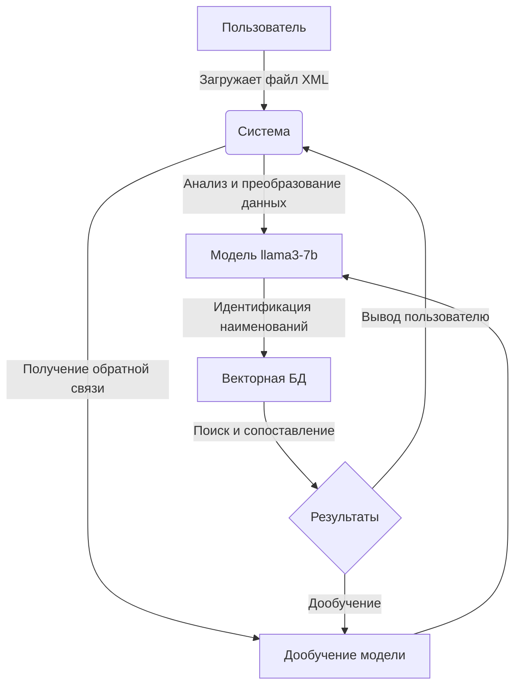
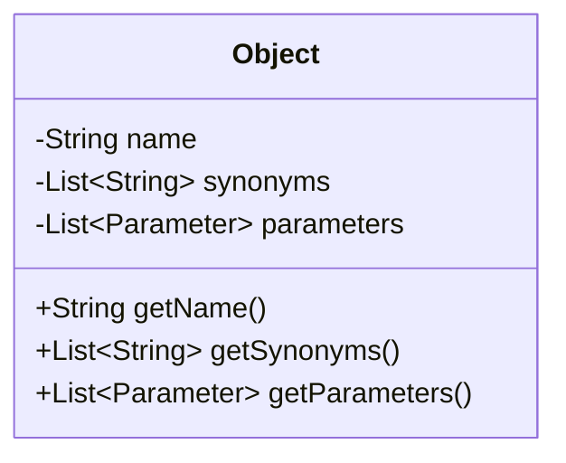
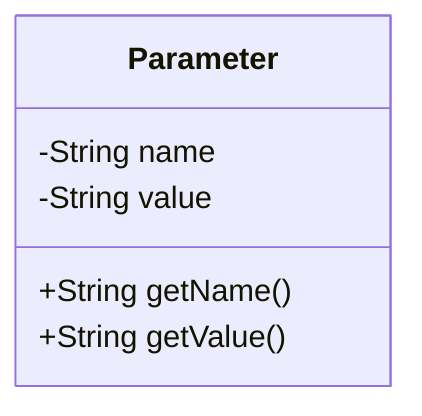
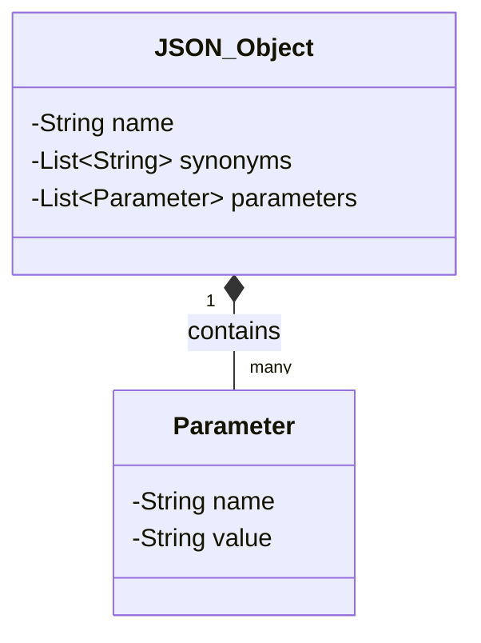
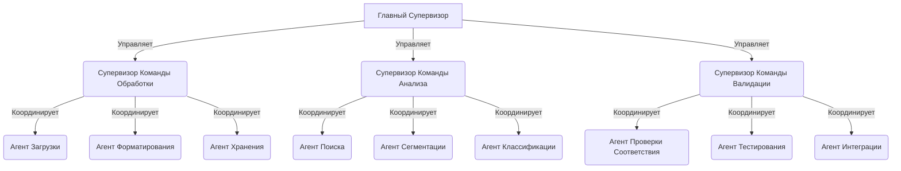
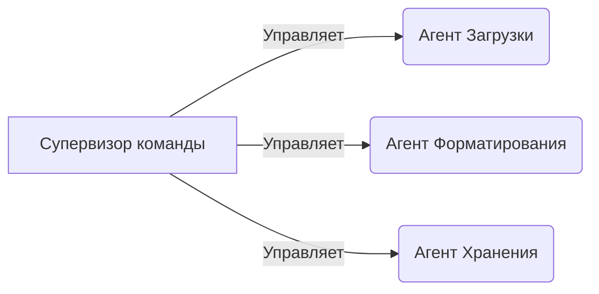
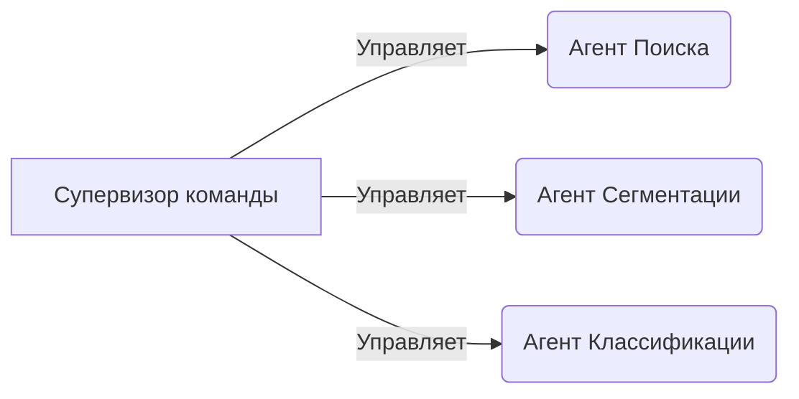
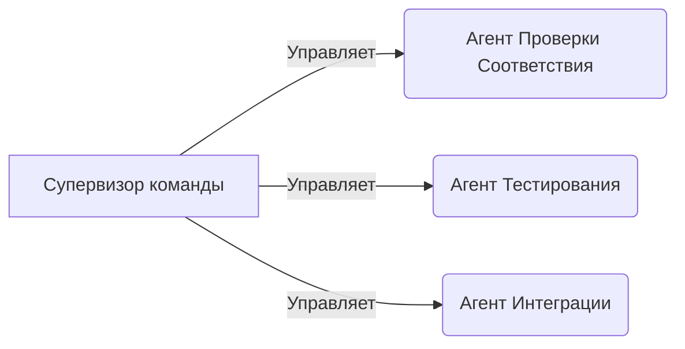

Система - программный продукт, использующий технологии машинного обучения для автоматизации процессов сопоставления строительных материалов, представленных на различных маркетплейсах, с единым классификатором строительных ресурсов (КСР). Основная цель системы — упрощение процесса поиска и сопоставления материалов, что способствует повышению эффективности управления закупками на строительных проектах.

Алгоритм работы системы включает следующие шаги:

1. Загрузка пользователем списка материалов с маркетплейса в формате XML.
2. Анализ и обработка данных с использованием модели llama3-7b для выявления соответствующих наименований в КСР.
3. Вывод результатов пользователю и возможность корректировки результатов для улучшения точности сопоставления.
4. Дообучение модели на основе пользовательского взаимодействия для повышения точности идентификации в будущем.

Технологическая стек и инструментарий:

- Векторная БД: **???**
- Python: Язык программирования для создания бэкенда системы.
- llama3-7b: Модель машинного обучения для анализа и обработки данных.
- Docker и Kubernetes: Используются для развертывания и масштабирования приложения в производственной среде.
- Git: Версионный контроль для управления кодом проекта.




# Данные 

## Объект

Объект представляет собой строительный материал или продукт, который имеет множество атрибутов, таких как наименование, синонимы и параметры.



### Структура

`name` - наименование согласно КРС (например Лист)
`syn_name` - список синтезированных и найденных на рынке наименований
`params` - список параметров

### Методы

`get-syn-names` - получение синтетических и рыночных наименований

## Параметр

Каждый объект может иметь несколько параметров, таких как размер, материал, цвет и т.д. Параметры помогают в дополнительной идентификации и классификации материалов.



### Структура

`name` - наименование параметра (например `Ширина`)
`value` - значение параметра (наприер `100мм`)

### Методы

`get-syn-param-names` - получение синтетических и рыночных наименований параметра
`get-syn-values` - получение синтетических и рыночных значений

Для углубления раздела "Данные" в вашем документе мы можем добавить более детальное описание структур данных, используемых в системе, их взаимодействия, а также код для иллюстрации работы с этими данными. Вот предложенные углубления и дополнения:

Пример кода для работы с объектами и параметрами:

```python
class Object:
    def __init__(self, name, synonyms, parameters):
        self.name = name
        self.synonyms = synonyms
        self.parameters = parameters

    def add_parameter(self, parameter):
        self.parameters.append(parameter)

class Parameter:
    def __init__(self, name, value):
        self.name = name
        self.value = value
```

Пример создания объекта и добавления параметров

```python
wood = Object("Деревянный Брус", ["Брус", "Дерево"], [])
dimension = Parameter("Размер", "100x200 мм")
wood.add_parameter(dimension)

print(wood.name)  # Вывод: Деревянный Брус
print(wood.parameters[0].name)  # Вывод: Размер
```

# Формат обмена

```json
{
    "name": "Лист хризотилцементный",
    "synonyms": ["панель", "плита", "листовой материал"],
    "parameters": [
        {
            "name": "материал",
            "value": "хризотилцемент"
        },
        {
            "name": "форма",
            "value": "волнистый"
        },
        {
            "name": "толщина",
            "value": "5.2 мм"
        }
    ]
}
```



```python
import requests

def send_data(url, data):
    response = requests.post(url, json=data)
    return response.status_code, response.json()

data = {
    "name": "Лист хризотилцементный",
    "synonyms": ["панель", "плита", "листовой материал"],
    "parameters": [
        {"name": "материал", "value": "хризотилцемент"},
        {"name": "форма", "value": "волнистый"},
        {"name": "толщина", "value": "5.2 мм"}
    ]
}

url = 'https://api.yoursystem.com/materials'
status_code, response = send_data(url, data)
print(f"Status code: {status_code}, Response: {response}")
```

# Агенты

## Команда 1: Разделения на наименование и параметры

Задачи:
1. Определить наименование 
	1. Определить наименование
	2. Привести в форму
	3. Проверить на отсутствие параметра в названии
2. Определить параметры
	1. Рассмотреть всё, кроме наименования
	2. Разделение параметров
	3. Если у параметра отсутствует наименование - синтезировать
3. Передача
	1. Создание JSON
	2. Проверка созданного JSON

## Команда 2: Синтеза 

Задачи:
1. Синтез наименования 
	1. С помощью [Wikidata API](https://www.mediawiki.org/wiki/API:Main_page)
	2. С помощью модели
		1. без дополнительных данных
		2. на основе БД с маркетплейсов
		3. на основе БД с КСР
		4. на основе запроса в поисковике [DuckDuckGoSearch](https://js.langchain.com/v0.2/docs/integrations/tools/duckduckgo_search/)
2.  Синтез параметров 
	1. Наименования параметра (длина -> дл -> l -> ...)
	2. Значения параметра
		1. Перевод в эталонные ед. изм.
3. Полный синтез 

> 		Пример:
> 		габариты -> [длина, ширина, высота]
> 		100x200x300мм -> [100мм, 200мм, 300мм]

Инструменты: 
- Поиск в интернете 
- Поиск в БД по данным с маркетплейсов
- Поиск в БД по КСР
- [Wikidata API](https://www.mediawiki.org/wiki/API:Main_page)

## Команда 3: Поиска и сопоставления

1. Поиск несколько вариантов пар код-наименование из КСР на основе созданных командами 1 и 2 данных
2. Проверка и выбор одного варианта
3. Преобразование в формата для передачи данных (JSON)

---

### Агенты



### Команда: Команда Обработки



#### Агент: Агент Загрузки

**Описание**: Отвечает за загрузку данных из внешних источников.

```
Загрузите данные из указанного источника и подготовьте их к дальнейшей обработке
```

```python
from langchain.chains import ChainedFunction, DataRetrieval

def load_data(source):
    # Загрузка данных
    return source.read_data()

load_data_chain = ChainedFunction(
    functions=[DataRetrieval(retrieve_function=load_data)]
)
```

#### Агент: Агент Форматирования

**Описание**: Преобразует загруженные данные в нужный формат.

```
Преобразуйте загруженные данные в формат, подходящий для хранения и анализа
```

```python
from langchain.chains import ChainedFunction, DataTransformation

def format_data(raw_data):
    # Форматирование данных
    return process_data(raw_data)

format_data_chain = ChainedFunction(
    functions=[DataTransformation(transform_function=format_data)]
)
```

#### Агент: Агент Хранения

**Описание**: Сохраняет обработанные данные в базе данных.

```
Сохраните обработанные данные для дальнейшего доступа и использования
```

```python
from langchain.chains import ChainedFunction, DataExport

def store_data(formatted_data):
    # Сохранение данных
    database.save(formatted_data)

store_data_chain = ChainedFunction(
    functions=[DataExport(export_function=store_data)]
)
```

### Команда: Команда Анализа



#### Агент: Агент Поиска

**Описание**: Выполняет поиск и идентификацию данных в хранилище.

```
Найдите и идентифицируйте необходимые данные в хранилище на основе заданных критериев
```

```python
from langchain.chains import ChainedFunction, DataRetrieval

def search_data(criteria):
    # Поиск данных
    return database.search(criteria)

search_data_chain = ChainedFunction(
    functions=[DataRetrieval(retrieve_function=search_data)]
)
```

#### Агент: Агент Сегментации

**Описание**: Разделяет данные на сегменты для удобства анализа.

```
Разделите данные на логические сегменты для удобства дальнейшего анализа
```

```python
from langchain.chains import ChainedFunction, DataTransformation

def segment_data(data):
    # Сегментация данных
    return segment_logic(data)

segment_data_chain = ChainedFunction(
    functions=[DataTransformation(transform_function=segment_data)]
)
```

#### Агент: Агент Классификации

**Описание**: Классифицирует данные по определенным категориям.

```
Классифицируйте данные на основе заранее определенных категорий для дальнейшего использования
```

```python
from langchain.chains import ChainedFunction, DataTransformation

def classify_data(data):
    # Классификация данных
    return classification_model.predict(data)

classify_data_chain = ChainedFunction(
    functions=[DataTransformation(transform_function=classify_data)]
)
```

### Команда: Команда Валидации



#### Агент: Агент Проверки Соответствия

**Описание**: Проверяет данные на соответствие стандартам и требованиям.

```
Проверьте данные на соответствие заданным стандартам и требованиям безопасности
```

```python
from langchain.chains import ChainedFunction, DataValidation

def validate_data(data):
    # Проверка соответствия данных
    return validate_standards(data)

validate_data_chain = ChainedFunction(
    functions=[DataValidation(validate_function=validate_data)]
)
```

#### Агент: Агент Тестирования

**Описание**: Тестирует данные и систему на устойчивость и корректность работы.

```
Проведите комплексное тестирование системы и данных для обеспечения их корректной работы
```

```python
from langchain.chains import ChainedFunction, DataTesting

def test_data(data):
    # Тестирование данных
    return run_tests(data)

test_data_chain = ChainedFunction(
    functions=[DataTesting(test_function=test_data)]
)
```

#### Агент: Агент Интеграции

**Описание**: Интегрирует проверенные и тестированные данные с другими системами.

```
Интегрируйте проверенные данные с другими системами для обеспечения полноценной работы
```

```python
from langchain.chains import ChainedFunction, DataIntegration

def integrate_data(data):
    # Интеграция данных
    return integrate_systems(data)

integration_data_chain = ChainedFunction(
    functions=[DataIntegration(integrate_function=integrate_data)]
)
```

