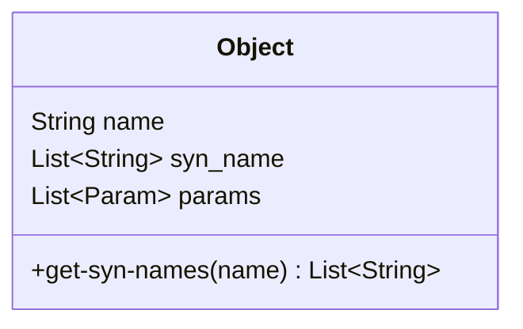
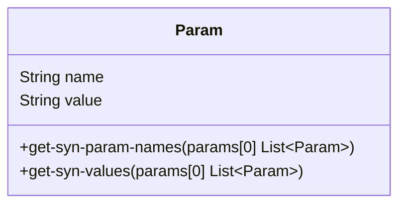

# Данные 

## Объект



### Параметры

`name` - наименование согласно КРС (например Лист)
`syn_name` - список синтезированных и найденных на рынке наименований
`params` - список параметров

### Методы

`get-syn-names` - получение синтетических и рыночных наименований

## Параметр



### Параметры

`name` - наименование параметра (например `Ширина`)
`value` - значение параметра (наприер `100мм`)

### Методы

`get-syn-param-names` - получение синтетических и рыночных наименований параметра
`get-syn-values` - получение синтетических и рыночных значений

# Формат

## JSON

23.65.12.111.01.1.01.04-1018-000
лист хризотилцементный волнистый профиль 40/150 7-волновой толщина 5,2 мм


```json
{
	"name": "лист",
	"syn_names": [
		"панель", "плита", "листовой материал", "хризотилцементная панель", "хризотилцементная плита", ...
	]
	"params": [
		{
			"name": "материал",
			"value": "хризотилцемент"
		},
		{
			"name": "форма",
			"value": "волнистый"
		},
		...
	]
}
```

